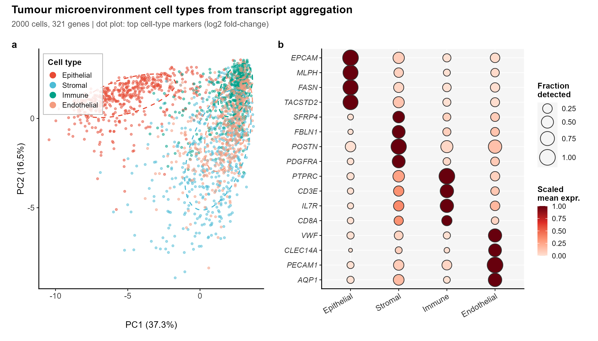
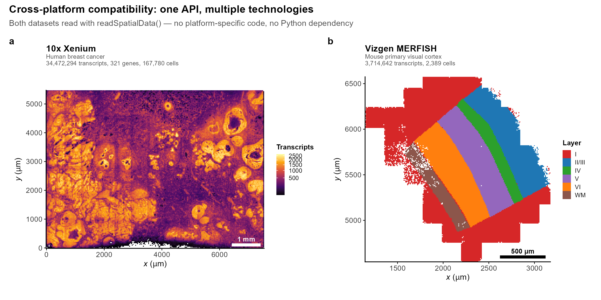

<div align="center">

# SpatialDataR

*Native R/Bioconductor Interface to the SpatialData Zarr Format for Spatial Omics*

[](https://github.com/CuiweiG/SpatialDataR/actions/workflows/R-CMD-check.yml)
[](https://opensource.org/licenses/Artistic-2.0)
[](https://bioconductor.org/)

</div>

---

## Why SpatialDataR?

SpatialData (Marconato et al. 2024, *Nat Methods*) established a
universal Zarr-based on-disk format for spatial omics, adopted by the
scverse ecosystem and supported by 10x Genomics Xenium, Vizgen MERFISH,
and NanoString CosMx platforms. However, R/Bioconductor users currently
require Python (via `reticulate`) to access these stores, creating
friction in analysis workflows that otherwise run entirely in R.

**SpatialDataR** provides a native R interface for reading, querying,
aggregating, transforming, and writing SpatialData-formatted Zarr
stores, exposing elements through Bioconductor-standard S4 classes:

- **Points and shapes**: `DataFrame` (CSV, Parquet, GeoParquet)
- **Images and labels**: lazy path references, loadable as in-memory
  arrays (`readZarrArray()`) or `DelayedArray` (`readZarrDelayed()`)
- **Tables**: AnnData-style obs/var, with optional `SpatialExperiment`
  coercion
- **Transforms**: OME-NGFF coordinate transforms (identity, scale,
  translation, affine, sequence) in 2D/3D

## Validation

Figures 1--4 use the **10x Xenium human breast cancer** dataset
(Janesick et al. 2023, *Nat Commun*): **34,472,294 transcripts**,
**321 genes**, **167,780 cells** across a 7.5 x 5.5 mm tissue section.
Figure 5 adds the **Vizgen MERFISH mouse brain** dataset (Moffitt
et al. 2018, *Science*): **3,714,642 transcripts**, **2,389 cells**.
Both read from SpatialData Zarr stores using `readSpatialData()`.
CC BY 4.0 / CC0 1.0. Reproducible via `inst/scripts/`.

---

## 1. Multi-element spatial data store read in a single call

<div align="center">

</div>

> **Fig. 1.** (**a**) Transcript density map (34.5M molecules, 30 um
> bins) reveals ductal architecture, tumour nests, and stromal
> compartments. (**b**) Cell centroids (167,780 cells) coloured by
> total transcript count. Both elements read from a single
> `readSpatialData()` call. Scale bar: 1 mm.

```r
library(SpatialDataR)
sd <- readSpatialData("xenium_breast.zarr")
sd
#> SpatialData object
#>   spatialPoints(1): transcripts [34472294 rows]
#>   shapes(3): cell_boundaries, cell_circles, xenium_landmarks
#>   images(2): morphology_focus, morphology_mip
#>   tables(1): table [167780 obs x 313 var]
#>   coordinate_systems: global
```

---

## 2. Spatial bounding-box query isolates tumour microenvironment

<div align="center">

</div>

> **Fig. 2.** (**a**) Tissue overview with 1 x 1 mm ROI (white box).
> (**b**) Zoomed ROI showing 721,846 transcripts across 3,707 cells.
> Top 6 genes by frequency are coloured; remaining transcripts in
> grey. ERBB2-positive tumour cells and LUM/POSTN-positive
> cancer-associated fibroblasts occupy complementary spatial domains.
> Scale bar: 200 um.

```r
roi <- bboxQuery(sd,
    xmin = 3200, xmax = 4200,
    ymin = 2200, ymax = 3200)
```

---

## 3. Cell-type resolved gene expression across the tumour

<div align="center">

</div>

> **Fig. 3.** Heatmap of 2,000 cells (stratified subsample of
> 166,364) x 30 genes (top variable of 321). Cell types assigned by
> canonical marker expression: EPCAM (epithelial), LUM/POSTN/SFRP4
> (stromal), PTPRC (immune), PECAM1 (endothelial). Log-normalised,
> column Z-scored (clipped at +/-2), hierarchically clustered
> (Ward's D2). Left strip: cell type annotation.

```r
counts <- aggregatePoints(
    spatialPoints(sd)[["transcripts"]],
    shapes(sd)[["cell_circles"]],
    feature_col = "gene", region_col = "cell_id")
```

---

## 4. Tumour microenvironment cell types from transcript aggregation

<div align="center">

</div>

> **Fig. 4.** (**a**) PCA of log-normalised aggregated counts (2,000
> cells, 30 genes) coloured by cell type with 68% confidence
> ellipses. Four populations are clearly separated. (**b**) Dot plot
> of top 16 cell-type-discriminating genes (log2 fold-change). Dot
> size: fraction of cells with non-zero counts; colour: scaled mean
> expression. Canonical markers confirmed: EPCAM/KRT8 (epithelial),
> LUM/POSTN/PDGFRA (stromal), CD3E/PTPRC (immune),
> VWF/PECAM1 (endothelial).

```r
# Direct integration with Bioconductor
library(SingleCellExperiment)
sce <- SingleCellExperiment(assays = list(counts = t(count_mat)))
colData(sce)$cell_type <- cell_types
```

---

## 5. Cross-platform compatibility: one API, multiple technologies

<div align="center">

</div>

> **Fig. 5.** (**a**) 10x Xenium human breast cancer (34.5M
> transcripts, 167,780 cells, transcript density map). (**b**) Vizgen
> MERFISH mouse primary visual cortex (3.7M transcripts, 2,389
> cells, cortical layer annotation). Both datasets read with the same
> `readSpatialData()` call — no platform-specific code, no Python
> dependency.

```r
# Same API for any SpatialData Zarr store
sd_xenium  <- readSpatialData("xenium_breast.zarr")
sd_merfish <- readSpatialData("merfish_brain.zarr")

# Identical downstream workflow
pts_xen <- spatialPoints(sd_xenium)[["transcripts"]]
pts_mer <- spatialPoints(sd_merfish)[["single_molecule"]]
```

---

## Additional Functions

| Function | Description |
|---|---|
| `composeTransforms()` | Chain affine transforms (2D/3D) |
| `invertTransform()` | Compute inverse transform |
| `writeSpatialData()` | Write SpatialData Zarr stores |
| `validateSpatialData()` | Spec compliance checker (14 criteria) |
| `combineSpatialData()` | Multi-sample merge with auto-prefix |
| `filterSample()` | Extract single sample |
| `cropImage()` | Crop Zarr image by bounding box |
| `readZarrDelayed()` | Out-of-memory `DelayedArray` access |
| `assignToRegions()` | Nearest-neighbour point-to-region assignment |
| `elementSummary()` | Element overview table |
| `coordinateSystemElements()` | Map coordinate systems to elements |

---

## Installation

```r
if (!requireNamespace("remotes", quietly = TRUE))
    install.packages("remotes")
remotes::install_github("CuiweiG/SpatialDataR")

# Optional backends
BiocManager::install("Rarr")                 # Zarr arrays
install.packages("arrow")                    # Parquet
BiocManager::install("SpatialExperiment")    # Table coercion
```

## References

1. Marconato L et al. (2024). SpatialData: an open and universal data
   framework for spatial omics. *Nat Methods* 21:2196--2209.
   doi:[10.1038/s41592-024-02212-x](https://doi.org/10.1038/s41592-024-02212-x)

2. Janesick A et al. (2023). High resolution mapping of the tumor
   microenvironment using integrated single-cell, spatial and in situ
   analysis. *Nat Commun* 14:8353.
   doi:[10.1038/s41467-023-43458-x](https://doi.org/10.1038/s41467-023-43458-x)

3. Moore J et al. (2023). OME-Zarr: a cloud-optimized bioimaging file
   format. *Histochem Cell Biol* 160:223--251.
   doi:[10.1007/s00418-023-02209-1](https://doi.org/10.1007/s00418-023-02209-1)

4. Righelli D et al. (2022). SpatialExperiment: infrastructure for
   spatially-resolved transcriptomics data in R. *Bioinformatics*
   38:3128--3131.
   doi:[10.1093/bioinformatics/btac299](https://doi.org/10.1093/bioinformatics/btac299)

5. Parker TJ et al. (2023). MoleculeExperiment enables consistent
   infrastructure for molecule-resolved spatial omics. *Bioinformatics*
   39:btad550.
   doi:[10.1093/bioinformatics/btad550](https://doi.org/10.1093/bioinformatics/btad550)
