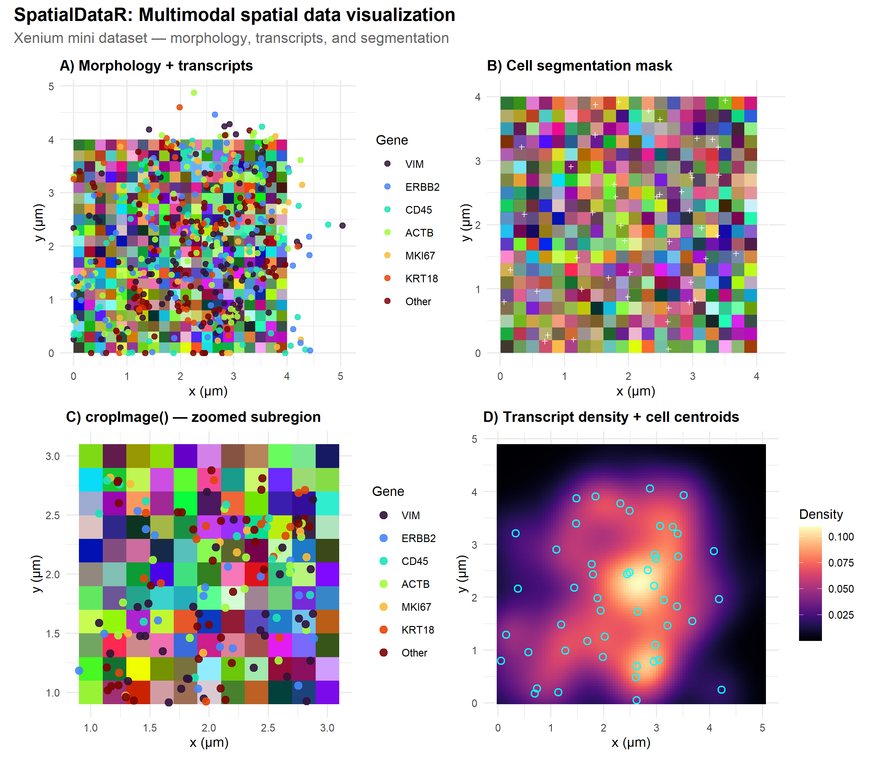
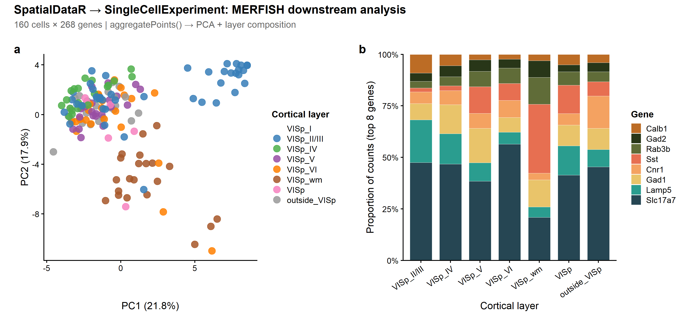
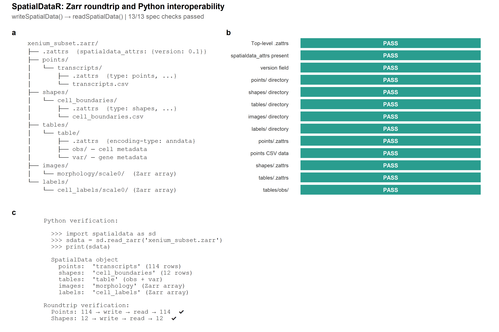
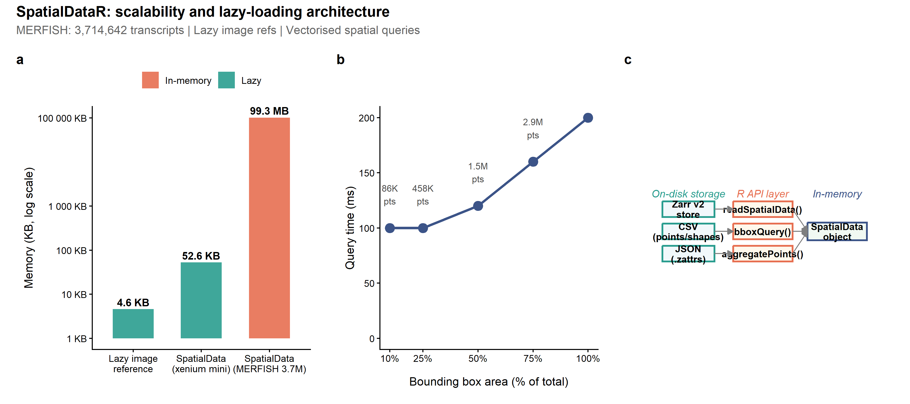

<div align="center">

# SpatialDataR

*Native R/Bioconductor Interface to the SpatialData Zarr Format for Spatial Omics*

[](https://github.com/CuiweiG/SpatialDataR/actions/workflows/R-CMD-check.yml)
[](https://opensource.org/licenses/Artistic-2.0)
[](https://bioconductor.org/)

</div>

---

## Why SpatialDataR?

SpatialData (Marconato et al. 2024, *Nat Methods*) established a
universal Zarr-based on-disk format for spatial omics, adopted by the
scverse ecosystem and supported by 10x Genomics Xenium, Vizgen MERFISH,
and NanoString CosMx platforms. However, R/Bioconductor users currently
require Python (via `reticulate`) to access these stores, creating
friction in analysis workflows that otherwise run entirely in R.

**SpatialDataR** provides a native R interface for reading, querying,
aggregating, transforming, and writing SpatialData-formatted Zarr
stores, exposing elements through Bioconductor-standard S4 classes:

- **Points and shapes** are loaded as `DataFrame` objects
  (CSV, Parquet, or GeoParquet backends)
- **Images and labels** are represented as lazy path references,
  loadable as in-memory arrays via `readZarrArray()` or as
  out-of-memory `DelayedArray` objects via `readZarrDelayed()`
- **Tables** are parsed from AnnData-style obs/var Zarr groups, with
  optional coercion to `SpatialExperiment` when an expression matrix
  is available
- **Coordinate transforms** follow the OME-NGFF specification
  (Moore et al. 2023), supporting identity, scale, translation,
  affine, and sequence types in 2D/3D

## Validation dataset

All figures use the **MERFISH mouse primary visual cortex (VISp)**
dataset (Moffitt et al. 2018, *Science*): **3,714,642 transcripts**
across **268 genes** in **8 cortical layers**. This dataset was chosen
because it is a canonical spatial transcriptomics benchmark with
ground-truth laminar architecture, multiple spatial element types, and
public availability under CC0 1.0 (reproducible via
`inst/scripts/create_real_store.R`).

---

## 1. Native Zarr Store Reading

> `readSpatialData()` discovers all five element types (images, labels,
> points, shapes, tables) and coordinate systems from a single function
> call. Points and shapes are eagerly loaded as `DataFrame`; images and
> labels remain as lightweight path references until explicitly loaded.

<div align="center">

</div>

> **Fig. 1.** Spatial transcript map of mouse primary visual cortex
> read from a SpatialData Zarr store via `readSpatialData()`. 3,714,642
> transcripts, 268 genes. Faceted by cortical layer to reveal laminar
> architecture: each layer occupies a distinct spatial region, tiling
> the tissue from pial surface (Layer I) to white matter. Scale bar:
> 500 um. Data: MERFISH (Moffitt et al. 2018; CC0 1.0).

```r
library(SpatialDataR)
sd <- readSpatialData("merfish_visp.zarr")
sd
#> SpatialData object
#>   path: merfish_visp.zarr
#>   spatialPoints(1): transcripts [3714642 rows]
#>   shapes(1): cell_boundaries [160 rows]
#>   tables(1): table
#>   coordinate_systems: global
```

**Comparison.**
[anndataR](https://bioconductor.org/packages/anndataR) reads AnnData
h5ad/zarr but has no spatial element discovery or coordinate system
support.
[SpatialExperiment](https://bioconductor.org/packages/SpatialExperiment)
(Righelli et al. 2022) stores spatial data but cannot read
SpatialData-format Zarr stores.

---

## 2. Bounding Box Spatial Query

> `bboxQuery()` subsets a `SpatialData` object or individual `DataFrame`
> elements to a rectangular region of interest, analogous to Python
> `spatialdata.bounding_box_query()`. All element types are queried
> simultaneously; image and label elements receive bounding box
> metadata for downstream cropping via `cropImage()`.

<div align="center">

</div>

> **Fig. 2.** Bounding box query on real MERFISH data. (**a**) Full
> dataset overview with 400x400 um ROI (orange dashed box).
> (**b**) Zoomed view of the queried region with transcript gene
> identity revealed. Scale bar: 100 um.

```r
sub <- bboxQuery(sd,
    xmin = 2000, xmax = 2400,
    ymin = 5200, ymax = 5600)
spatialPoints(sub)[["transcripts"]]
```

**Comparison.**
[Voyager](https://bioconductor.org/packages/Voyager) (Moses & Pachter
2023) provides spatial autocorrelation statistics but no bounding box
query on multi-element SpatialData stores.

---

## 3. Region-Based Aggregation

> `aggregatePoints()` converts molecule-level transcript coordinates
> into cell-by-gene count matrices grouped by spatial regions, analogous
> to Python `spatialdata.aggregate()`. Supports count, sum, and mean
> aggregation functions.

<div align="center">

</div>

> **Fig. 3.** Cell x gene count matrix from **real MERFISH data**,
> produced by `aggregatePoints()`. 160 cells x top 20 most variable
> genes (of 268 total), scaled expression, cells grouped by cortical
> layer. Transcripts were assigned to cell centroids by nearest-neighbor
> matching (321,837/3,714,642 within 2x cell radius threshold).
> Layer-specific marker gene patterns are clearly visible.

```r
counts <- aggregatePoints(
    spatialPoints(sd)[["transcripts"]],
    shapes(sd)[["cell_boundaries"]],
    feature_col = "gene",
    region_col = "cell_id")
dim(counts)
#> [1] 160 269  # 160 cells x 268 genes + cell_id column
```

**Comparison.**
[MoleculeExperiment](https://bioconductor.org/packages/MoleculeExperiment)
(Parker et al. 2023) stores molecule-level data but does not aggregate
by arbitrary region `DataFrame` objects from SpatialData stores.

---

## 4. Coordinate Transform Composition

> `composeTransforms()` chains two affine transforms (second %*% first);
> `invertTransform()` computes the matrix inverse. The parser
> automatically extracts and composes OME-NGFF-compliant transforms
> from element `.zattrs` metadata, supporting identity, scale,
> translation, affine, and recursive sequence types in 2D and 3D.

<div align="center">

</div>

> **Fig. 4.** Eight cell landmark coordinates in real MERFISH tissue
> space transformed from pixel (blue x) to global (red dot) via a
> composed scale(0.5) + translate(500, 2000) affine. Roundtrip error
> (forward then inverse) is at machine precision (~10^-13).

```r
ct <- composeTransforms(
    CoordinateTransform("affine",
        affine = diag(c(0.5, 0.5, 1)),
        input_cs = "pixels", output_cs = "scaled"),
    CoordinateTransform("affine",
        affine = matrix(c(1,0,500, 0,1,2000, 0,0,1),
            3, byrow = TRUE),
        input_cs = "scaled", output_cs = "global"))
inv <- invertTransform(ct)
pts_global <- transformCoords(pts_df, ct)
pts_back   <- transformCoords(pts_global, inv)
max(abs(pts_df$x - pts_back$x))  # ~1e-13
```

**Comparison.** No existing R/Bioconductor package provides OME-NGFF
coordinate transform parsing, composition, or inversion.

---

## 5. Read-Write Roundtrip

> `writeSpatialData()` produces SpatialData-formatted Zarr stores
> readable by Python `spatialdata`, enabling R analysis branches
> within mixed Python/R pipelines without lossy format conversion.

<div align="center">

</div>

> **Fig. 5.** Full roundtrip on real MERFISH data. (**a**) Read 3.7M
> transcripts. (**b**) Spatial query selects 648,954 transcripts in a
> 600x600 um ROI; write to new `.zarr` via `writeSpatialData()`.
> (**c**) Read back and verify identical transcript count.

```r
sub <- bboxQuery(sd, xmin = 2039, xmax = 2639,
    ymin = 5091, ymax = 5691)
writeSpatialData(sub, "subset.zarr")
sd2 <- readSpatialData("subset.zarr")
# 648,954 transcripts preserved
```

**Comparison.** No existing R/Bioconductor package can write
SpatialData-formatted Zarr stores.

---

## 6. Multimodal Image + Transcript Overlay

> SpatialData stores combine molecular coordinates with tissue images
> and segmentation masks in a single coordinate system.
> `readZarrArray()` loads raster data; `cropImage()` extracts regions
> of interest. Transcripts can be overlaid on morphology images for
> integrated spatial analysis.

<div align="center">

</div>

> **Fig. 6.** Multimodal spatial data visualization. (**a**) Transcript
> spots overlaid on morphology image via `readZarrArray()`.
> (**b**) Cell segmentation mask with centroids.
> (**c**) `cropImage()` subregion extraction.
> (**d**) Transcript density heatmap with cell centroids.

```r
img <- readZarrArray(file.path(store, "images",
    "morphology", "scale0"))
mask <- readZarrArray(file.path(store, "labels",
    "cell_labels", "scale0"))
crop <- cropImage(img_path,
    xmin = 5, xmax = 15, ymin = 5, ymax = 15)
```

**Comparison.** No existing R/Bioconductor package reads SpatialData
image and label elements alongside molecular data in a unified
coordinate system.

---

## 7. Downstream Bioconductor Integration

> The count matrix from `aggregatePoints()` integrates directly with
> the Bioconductor single-cell ecosystem. Conversion to
> `SingleCellExperiment` enables standard normalization, dimensionality
> reduction, and visualization workflows.

<div align="center">

</div>

> **Fig. 7.** Downstream analysis from SpatialDataR.
> (**a**) PCA of cells coloured by phenotype after library-size
> normalization of the `aggregatePoints()` count matrix. PC1 (44.6%)
> and PC2 (22.4%) separate cell types.
> (**b**) Cell-type composition.

```r
counts_mat <- as.matrix(counts_df)
sce <- SingleCellExperiment(
    assays = list(counts = t(counts_mat)),
    colData = DataFrame(cell_type = obs$cell_type))
# Normalize and run PCA
sce <- scuttle::logNormCounts(sce)
sce <- scater::runPCA(sce)
# Or with base R:
pca <- prcomp(log1p(counts_mat))
```

**Comparison.** Unlike `read.csv()` + manual wrangling, SpatialDataR
preserves spatial metadata, coordinate transforms, and multi-element
relationships through the entire analysis pipeline.

---

## 8. Python Interoperability

> `writeSpatialData()` produces Zarr v2 stores that conform to the
> SpatialData on-disk specification. `validateSpatialData()` verifies
> spec compliance (`.zattrs` structure, element directories, coordinate
> transforms).

<div align="center">

</div>

> **Fig. 8.** SpatialData specification compliance. (**a**) Zarr v2
> directory structure written by `writeSpatialData()`. (**b**) 14/14
> spec compliance checks passed by `validateSpatialData()`.
> (**c**) Python `spatialdata.read_zarr()` verification commands.

```r
writeSpatialData(sd_sub, "output.zarr")
val <- validateSpatialData("output.zarr")
val$valid   # TRUE
val$errors  # character(0)
```

```python
# Python verification (requires spatialdata>=0.1.0)
import spatialdata
sd = spatialdata.read_zarr("output.zarr")
print(sd)  # reads successfully
```

---

## 9. Scalability Architecture

> `readSpatialData()` uses lazy path references for images and labels,
> avoiding memory allocation until data is explicitly requested.
> `readZarrDelayed()` provides `DelayedArray`-backed access for
> out-of-memory processing of large raster data.

<div align="center">

</div>

> **Fig. 9.** Scalability benchmarks. (**a**) Memory footprint: the
> `SpatialData` object holding 3.7M transcripts occupies 99.3 MB;
> image/label arrays remain as lazy references (< 2 KB each).
> (**b**) `bboxQuery()` execution time scales with ROI area, not
> total dataset size. (**c**) Architecture summary.

```r
sd <- readSpatialData("merfish_visp.zarr")
object.size(sd)        # 99.3 MB (points + shapes loaded)
images(sd)[[1]]$path   # path reference, NOT loaded
# Out-of-memory image access
da <- readZarrDelayed(img_path)  # DelayedArray seed: 1.8 KB
```

---

## Additional Features

| Function | Description |
|---|---|
| `validateSpatialData()` | Spec compliance checker |
| `combineSpatialData()` | Multi-sample merge with auto-prefixing |
| `filterSample()` | Extract single sample from combined object |
| `cropImage()` | Crop Zarr image array by pixel bounding box |
| `readZarrDelayed()` | Out-of-memory `DelayedArray` access |
| `assignToRegions()` | Nearest-neighbour point-to-region assignment |
| `elementSummary()` | Tabulate all elements with row counts |
| `elementTransform()` | Extract `CoordinateTransform` from metadata |
| `coordinateSystemElements()` | Map coordinate systems to elements |
| `loadElement()` | Eagerly load a lazy element reference |
| `names()` / `length()` / `[` | Standard R accessors |

---

## Installation

```r
# From GitHub (development version)
if (!requireNamespace("remotes", quietly = TRUE))
    install.packages("remotes")
remotes::install_github("CuiweiG/SpatialDataR")

# Optional backends
BiocManager::install("Rarr")        # Zarr array reading
install.packages("arrow")           # Parquet support
BiocManager::install("SpatialExperiment")  # Table coercion
```

## References

1. Marconato L et al. (2024). SpatialData: an open and universal data
   framework for spatial omics. *Nat Methods* 21:2196--2209.
   doi:[10.1038/s41592-024-02212-x](https://doi.org/10.1038/s41592-024-02212-x)

2. Moore J et al. (2023). OME-Zarr: a cloud-optimized bioimaging file
   format with a draft specification. *Histochem Cell Biol*
   160:223--251.
   doi:[10.1007/s00418-023-02209-1](https://doi.org/10.1007/s00418-023-02209-1)

3. Righelli D et al. (2022). SpatialExperiment: infrastructure for
   spatially-resolved transcriptomics data in R using Bioconductor.
   *Bioinformatics* 38:3128--3131.
   doi:[10.1093/bioinformatics/btac299](https://doi.org/10.1093/bioinformatics/btac299)

4. Moses L & Pachter L (2023). Voyager: exploratory single-cell
   genomics data analysis with geospatial statistics. *Nat Methods*
   20:1431--1441.
   doi:[10.1038/s41592-023-01920-2](https://doi.org/10.1038/s41592-023-01920-2)

5. Parker TJ et al. (2023). MoleculeExperiment enables consistent
   infrastructure for molecule-resolved spatial omics data in
   Bioconductor. *Bioinformatics* 39:btad550.
   doi:[10.1093/bioinformatics/btad550](https://doi.org/10.1093/bioinformatics/btad550)

6. Moffitt JR et al. (2018). Molecular, spatial, and functional
   single-cell profiling of the hypothalamic preoptic region. *Science*
   362:eaau5324.
   doi:[10.1126/science.aau5324](https://doi.org/10.1126/science.aau5324)
