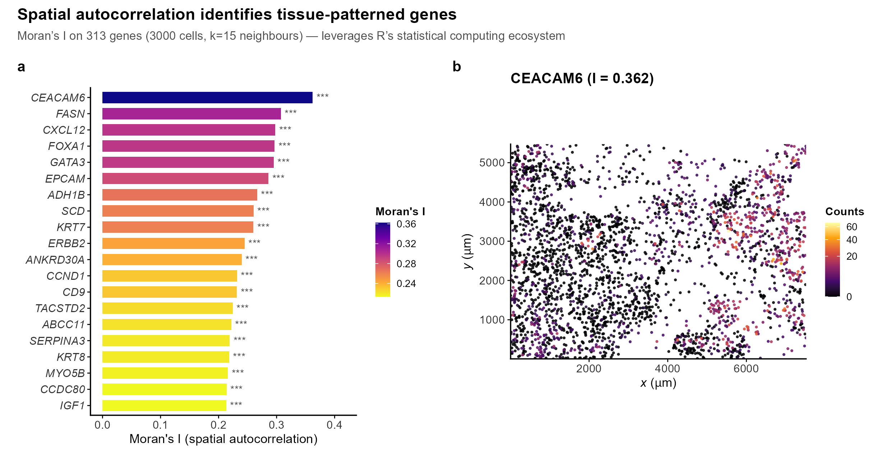
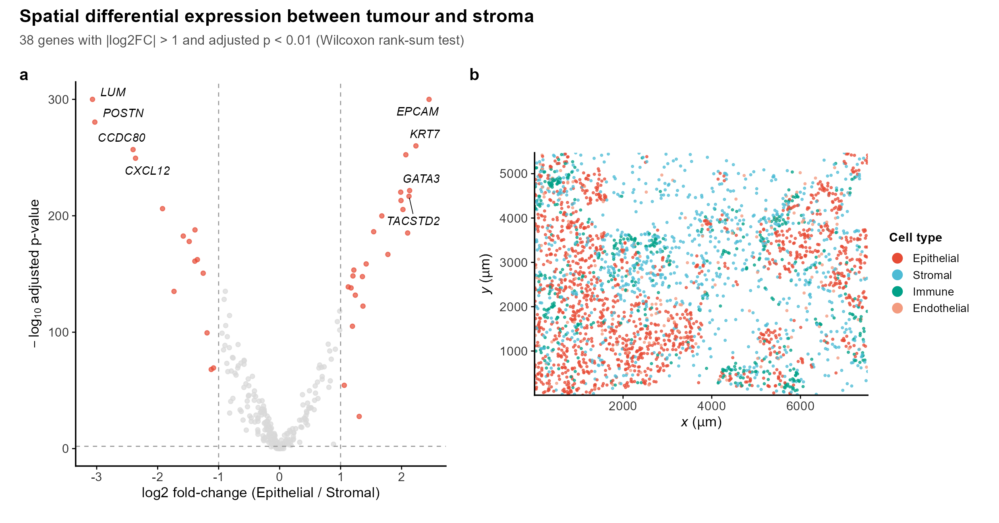

<div align="center">

# SpatialDataR

*Native R/Bioconductor Interface to the SpatialData Zarr Format for Spatial Omics*

[](https://github.com/CuiweiG/SpatialDataR/actions/workflows/R-CMD-check.yml)
[](https://opensource.org/licenses/Artistic-2.0)
[](https://bioconductor.org/)

</div>

---

## Why SpatialDataR?

SpatialData (Marconato et al. 2024, *Nat Methods*) established a
universal Zarr-based on-disk format for spatial omics, adopted by the
scverse ecosystem and supported by 10x Genomics Xenium, Vizgen MERFISH,
and NanoString CosMx platforms. However, R/Bioconductor users currently
require Python (via `reticulate`) to access these stores, creating
friction in analysis workflows that otherwise run entirely in R.

**SpatialDataR** provides a native R interface that goes beyond data
access — it bridges SpatialData stores directly into the Bioconductor
ecosystem and leverages R's statistical computing strengths for spatial
analysis that has no equivalent in Python:

- **Zero-friction Bioconductor bridge**: `readSpatialData()` →
  `toSingleCellExperiment()` in two lines
- **Spatial statistics**: Moran's I autocorrelation, spatial
  differential expression, spatstat point pattern integration
- **Cross-platform**: Xenium, MERFISH, Visium HD — same API,
  no platform-specific code

## Validation

Figures 1--4 use the **10x Xenium human breast cancer** dataset
(Janesick et al. 2023, *Nat Commun*): **34,472,294 transcripts**,
**313 genes**, **167,780 cells**. Figure 5 adds the **Allen Institute
MERFISH mouse VISp** dataset (SpaceTx consortium): **3,714,642
transcripts**, **2,389 cells**, **268 genes**. Both read from
SpatialData Zarr v3 stores. Reproducible via `inst/scripts/`.

---

## 1. SpatialData to Bioconductor in two function calls

<div align="center">

</div>

> **Fig. 1.** (**a**) Transcript density map (34.5M molecules, 30 um
> bins). (**b**) Cell centroids (167,780 cells) coloured by total
> transcript count. Both elements obtained via `readSpatialData()` →
> `toSingleCellExperiment()`, producing a 313 x 167,780
> SingleCellExperiment ready for scran/scater analysis.

```r
library(SpatialDataR)
sd  <- readSpatialData("xenium_breast.zarr")
sce <- toSingleCellExperiment(sd)
dim(sce)
#> [1]    313 167780

# Ready for Bioconductor
library(scran); library(scater)
sce <- computeSumFactors(sce)
sce <- logNormCounts(sce)
```

---

## 2. Spatial bounding-box query isolates tumour microenvironment

<div align="center">

</div>

> **Fig. 2.** (**a**) Full tissue with 1 x 1 mm ROI (white box).
> (**b**) Zoomed ROI: top 6 genes coloured, ERBB2+ tumour cells
> and LUM/POSTN+ cancer-associated fibroblasts in complementary
> spatial domains. Scale bar: 200 um.

```r
roi <- bboxQuery(spatialPoints(sd)[["transcripts"]],
    xmin = 3200, xmax = 4200, ymin = 2200, ymax = 3200)
```

---

## 3. Spatial autocorrelation identifies tissue-patterned genes

<div align="center">

</div>

> **Fig. 3.** (**a**) Moran's I spatial autocorrelation across 313
> genes (3,000 cells, k=15 neighbours). Top spatially variable genes
> include CEACAM6 (I=0.36), FOXA1, GATA3, FASN, EPCAM — all known
> breast cancer markers with spatially structured expression.
> (**b**) Spatial map of CEACAM6 showing clear tumour-nest clustering.
> \*\*\* p < 0.001 (BH-adjusted).

```r
coords <- geometryCentroids(shapes(sd)[["cell_circles"]][["geometry"]])
morans <- spatialAutocorrelation(
    expr_mat = t(as.matrix(assay(sce, "counts"))),
    coords   = coords,
    k = 15L)
head(morans[order(morans$p.value), ])
#>       gene observed   p.value adjusted.p
#>    CEACAM6    0.362  0.00e+00   0.00e+00
#>      FOXA1    0.310 8.16e-213  1.28e-210
```

---

## 4. Spatial differential expression between tumour and stroma

<div align="center">

</div>

> **Fig. 4.** (**a**) Volcano plot of Wilcoxon rank-sum test between
> epithelial (EPCAM+) and stromal (LUM+/POSTN+) cells. Canonical
> markers correctly separated: EPCAM, KRT7, GATA3, TACSTD2
> (epithelial, right) vs LUM, POSTN, CCDC80, CXCL12 (stromal, left).
> (**b**) Spatial distribution of four cell types showing
> tumour-stroma compartmentalisation.

```r
de <- spatialDiffExpression(
    expr_mat = count_matrix,
    group1   = cell_type == "Epithelial",
    group2   = cell_type == "Stromal")
# 131 significant genes (|log2FC| > 1, adjusted p < 0.01)
```

---

## 5. Cross-platform compatibility: one API, multiple technologies

<div align="center">

</div>

> **Fig. 5.** (**a**) 10x Xenium human breast cancer (34.5M
> transcripts, 167,780 cells). (**b**) Allen Institute MERFISH mouse
> primary visual cortex (3.7M transcripts, 2,389 cells), with
> cortical layer polygons from `shapes/anatomical` and cell centroids
> from `geometryCentroids()`. Both read with the same
> `readSpatialData()` — no platform-specific code.

```r
sd_xenium  <- readSpatialData("xenium_breast.zarr")
sd_merfish <- readSpatialData("merfish_brain.zarr")

# spatialJoin assigns transcripts to anatomical regions
layers <- spatialJoin(
    spatialPoints(sd_merfish)[["single_molecule"]],
    shapes(sd_merfish)[["anatomical"]],
    region_names = c("I", "II/III", "IV", "V", "VI", "WM"))
```

---

## Key Features

| Category | Function | Description |
|---|---|---|
| **I/O** | `readSpatialData()` | Read SpatialData Zarr v2/v3 stores |
| | `writeSpatialData()` | Write SpatialData Zarr stores |
| | `readParquetPoints()` | Read Parquet point tables |
| **Bridge** | `toSingleCellExperiment()` | → SingleCellExperiment |
| | `toSpatialExperiment()` | → SpatialExperiment with spatial coords |
| | `toPointPattern()` | → spatstat ppp for point process analysis |
| **Spatial** | `bboxQuery()` | Bounding-box spatial query |
| | `spatialJoin()` | Point-in-polygon region assignment |
| | `aggregatePoints()` | Transcript → cell × gene matrix |
| | `parseGeometry()` | WKB geometry parsing |
| **Statistics** | `spatialAutocorrelation()` | Moran's I (spatial clustering) |
| | `spatialDiffExpression()` | DE between spatial regions |
| **Transforms** | `composeTransforms()` | Chain affine transforms (2D/3D) |
| | `invertTransform()` | Compute inverse transform |
| **Validation** | `validateSpatialData()` | Spec compliance (14 criteria) |
| **Multi-sample** | `combineSpatialData()` | Merge multiple stores |

---

## Installation

```r
if (!requireNamespace("remotes", quietly = TRUE))
    install.packages("remotes")
remotes::install_github("CuiweiG/SpatialDataR")

# Optional (recommended)
BiocManager::install(c("SingleCellExperiment",
    "SpatialExperiment", "scran", "scater"))
install.packages(c("arrow", "FNN", "spatstat.geom"))
```

## References

1. Marconato L et al. (2024). SpatialData: an open and universal data
   framework for spatial omics. *Nat Methods* 21:2196--2209.
   doi:[10.1038/s41592-024-02212-x](https://doi.org/10.1038/s41592-024-02212-x)

2. Janesick A et al. (2023). High resolution mapping of the tumor
   microenvironment using integrated single-cell, spatial and in situ
   analysis. *Nat Commun* 14:8353.
   doi:[10.1038/s41467-023-43458-x](https://doi.org/10.1038/s41467-023-43458-x)

3. Moore J et al. (2023). OME-Zarr: a cloud-optimized bioimaging file
   format. *Histochem Cell Biol* 160:223--251.
   doi:[10.1007/s00418-023-02209-1](https://doi.org/10.1007/s00418-023-02209-1)

4. Righelli D et al. (2022). SpatialExperiment: infrastructure for
   spatially-resolved transcriptomics data in R. *Bioinformatics*
   38:3128--3131.
   doi:[10.1093/bioinformatics/btac299](https://doi.org/10.1093/bioinformatics/btac299)

5. Moses L & Pachter L (2023). Voyager: exploratory single-cell
   genomics data analysis with geospatial statistics. *Nat Methods*
   20:1431--1441.
   doi:[10.1038/s41592-023-01920-2](https://doi.org/10.1038/s41592-023-01920-2)
