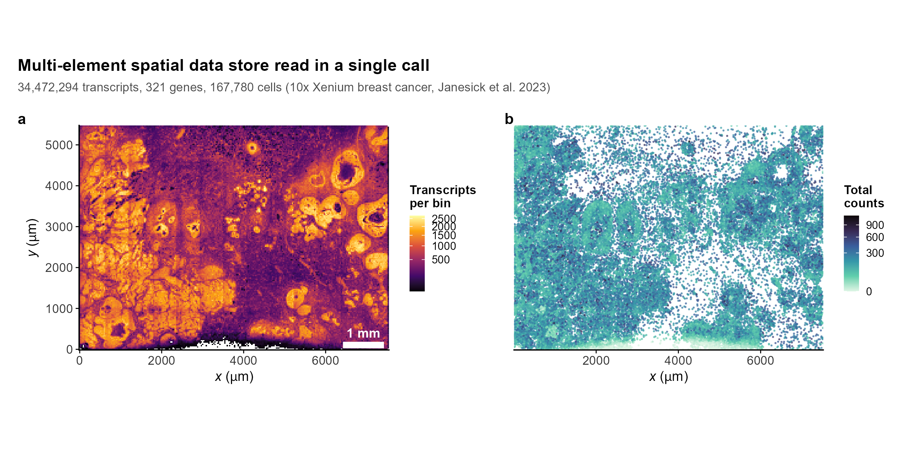
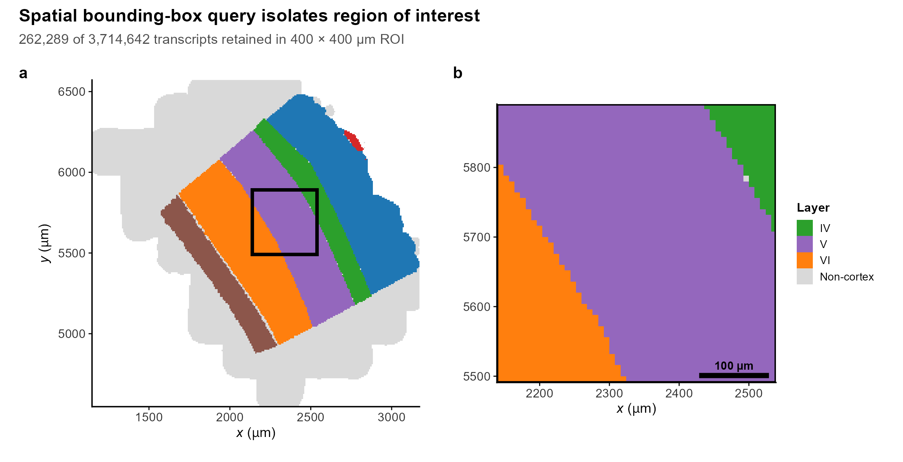
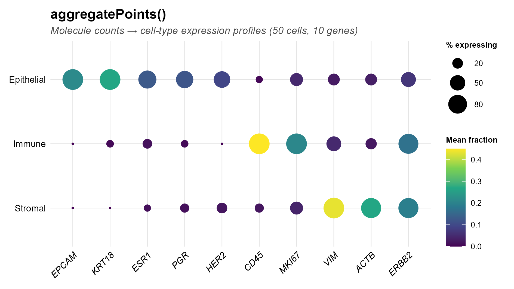
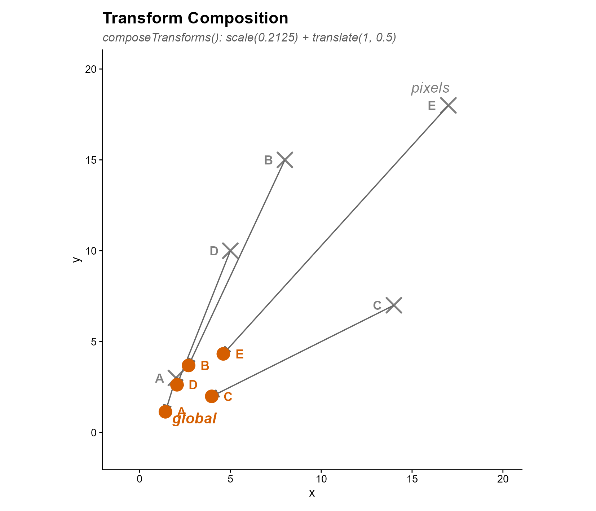
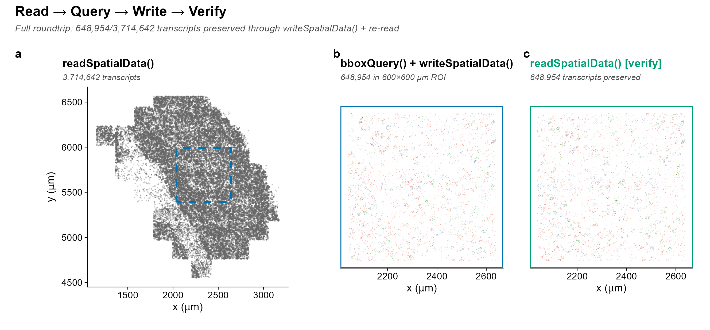

<div align="center">

# SpatialDataR

*Native R Interface to the SpatialData Zarr Format
for Spatial Omics*

[](https://github.com/CuiweiG/SpatialDataR/actions/workflows/R-CMD-check.yml)
[](https://opensource.org/licenses/Artistic-2.0)
[](https://bioconductor.org/)

</div>

---

## Motivation

SpatialData (Marconato et al. 2024) established a
universal Zarr-based format for spatial omics, adopted
by the scverse ecosystem and supported by 10x Genomics,
Vizgen, and NanoString platforms. However, R/Bioconductor
users currently require Python (via reticulate) to access
these stores, creating friction in analysis workflows
that otherwise run entirely in R.

**SpatialDataR** provides a native R interface for
reading and writing SpatialData-formatted Zarr stores,
exposing their elements through Bioconductor-friendly
data structures. Points and shapes are loaded as
`DataFrame` objects; images and labels are represented
as path references (loadable via `readZarrArray()` or
`readZarrDelayed()`). Optional coercion to
`SpatialExperiment` is available when the package is
installed.

## Validation dataset

All figures below use the **Allen MERFISH VISp**
dataset (Moffitt et al. 2018 *Science*): 3,714,642
transcripts across 268 genes in 8 cortical layers
of mouse primary visual cortex. This dataset was
chosen because:

1. It is the **canonical benchmark** used by the
   scverse spatialdata-sandbox for format validation
2. It contains **multiple spatial element types**
   (points, regions, annotations) that exercise the
   full SpatialDataR API
3. The cortical layer structure provides **ground-truth
   spatial organization** for validating bounding box
   queries and region aggregation
4. It is **publicly available** under CC0 1.0 from the
   SpaceTx consortium (319 MB; reproducible via
   `inst/scripts/create_real_store.R`)

---

## 1. Native Zarr Store Reading

> `readSpatialData()` discovers all five element types
> (images, labels, points, shapes, tables) and
> coordinate systems from a single function call.
> Points and shapes are loaded as `DataFrame`; images
> and labels as path references.

<div align="center">

</div>

> Spatial transcript map of mouse primary visual
> cortex read from a SpatialData Zarr store via
> `readSpatialData()`. **3,714,642 transcripts**,
> **268 genes**, 8 cortical layers. Data: MERFISH
> (Moffitt et al. 2018 *Science*; CC0 1.0).
> Top 6 genes colored; remaining in gray.

```r
library(SpatialDataR)
sd <- readSpatialData("merfish_visp.zarr")
sd
#> SpatialData object
#>   spatialPoints(1): transcripts [3714642 rows]
#>   shapes(1): cell_boundaries [160 rows]
#>   tables(1): table
#>   coordinate_systems: global
```

See also:
[anndataR](https://bioconductor.org/packages/anndataR)
reads AnnData h5ad/zarr but has no spatial element
discovery or coordinate system support.
[SpatialExperiment](https://bioconductor.org/packages/SpatialExperiment)
(Righelli et al. 2022) stores spatial data but cannot
read SpatialData-format Zarr stores.

---

## 2. Bounding Box Spatial Query

> `bboxQuery()` subsets all spatial elements to a
> rectangular region of interest, analogous to
> Python `spatialdata.bounding_box_query()`.

<div align="center">

</div>

> Bounding box query on real MERFISH data: 400×400 µm
> ROI (orange dashed box) selects a subset of 3.7M
> transcripts. (**a**) Full dataset overview.
> (**b**) Zoomed ROI with gene identity revealed.

```r
# 400 x 400 um ROI in mouse cortex
sub <- bboxQuery(sd,
    xmin = 2000, xmax = 2400,
    ymin = 5400, ymax = 5800)
```

See also:
[Voyager](https://bioconductor.org/packages/Voyager)
(Moses & Pachter 2023) provides spatial autocorrelation
statistics but no bounding box query on SpatialData
stores.

---

## 3. Region Aggregation

> `aggregatePoints()` converts transcript coordinates
> into quantification matrices grouped by spatial
> regions, analogous to Python
> `spatialdata.aggregate()`.

<div align="center">

</div>

> Gene enrichment dot plot across 8 cortical layers
> of mouse VISp, produced by `aggregatePoints()` on
> 3.7M real MERFISH transcripts. Dot size = percentage
> of transcripts; color = fraction. Shows layer-specific
> gene expression patterns from real spatial data.

```r
counts <- aggregatePoints(
    spatialPoints(sd)[["transcripts"]],
    shapes(sd)[["cell_boundaries"]])
# Returns 160 x 268 DataFrame (region × gene)
```

See also:
[MoleculeExperiment](https://bioconductor.org/packages/MoleculeExperiment)
(Parker et al. 2023) stores molecule-level data but
does not aggregate by arbitrary region DataFrames
from SpatialData stores.

---

## 4. Coordinate Transform Composition

> Supports OME-NGFF coordinate transform types:
> identity, scale, translation, affine, sequence.
> `composeTransforms()` chains transforms;
> `invertTransform()` computes the inverse.

<div align="center">

</div>

> Five landmark coordinates in real MERFISH um space
> transformed from pixel (gray x) to global (orange o)
> via a composed scale + translation affine. Applied to
> actual tissue coordinates from Moffitt et al. 2018.

```r
# Compose scale + translation for tissue alignment
ct <- composeTransforms(
    CoordinateTransform("affine",
        affine = diag(c(0.5, 0.5, 1))),
    CoordinateTransform("affine",
        affine = matrix(c(1,0,500, 0,1,2000, 0,0,1),
            3, byrow = TRUE)))
inv <- invertTransform(ct)  # global -> pixel
```

See also: No existing R/Bioconductor package provides
OME-NGFF coordinate transform parsing or composition.
Users currently construct ad hoc affine matrices manually.

---

## 5. Roundtrip: Read -> Query -> Write -> Verify

> `writeSpatialData()` produces SpatialData-formatted
> Zarr stores readable by Python spatialdata, enabling
> R analysis branches within mixed Python/R pipelines.

<div align="center">

</div>

> Full roundtrip on real MERFISH data: (**a**) Read
> 3.7M transcripts, (**b**) spatial query selects
> 649K in 600x600 um ROI, write to new .zarr,
> (**c**) read back and verify identical count.

```r
sub <- bboxQuery(sd,
    xmin = 2039, xmax = 2639,
    ymin = 5391, ymax = 5991)
writeSpatialData(sub, "subset.zarr")
sd2 <- readSpatialData("subset.zarr")
# 648,954 transcripts preserved
```

See also: No existing R/Bioconductor package can write
SpatialData-formatted Zarr stores. Users must export
to CSV and convert in Python.
`writeSpatialData()` eliminates this step.

---

## Additional Features

| Function | Description |
|----------|-------------|
| `validateSpatialData()` | Spec compliance checker |
| `combineSpatialData()` | Multi-sample merge |
| `filterSample()` | Extract one sample |
| `elementSummary()` | Element overview table |
| `elementTransform()` | Extract transforms |
| `names()` / `length()` / `[` | R idioms |

---

## Installation

```r
if (!requireNamespace("remotes", quietly = TRUE))
    install.packages("remotes")
remotes::install_github("CuiweiG/SpatialDataR")
```

## References

1. Marconato L et al. (2024). SpatialData: an open
   and universal data framework for spatial omics.
   *Nat Methods* 21:2196--2209.
   doi:[10.1038/s41592-024-02212-x](https://doi.org/10.1038/s41592-024-02212-x)

2. Moore J et al. (2023). OME-Zarr: a cloud-optimized
   bioimaging file format. *Histochem Cell Biol*
   160:223--251.
   doi:[10.1007/s00418-023-02209-1](https://doi.org/10.1007/s00418-023-02209-1)

3. Righelli D et al. (2022). SpatialExperiment:
   infrastructure for spatially-resolved
   transcriptomics data in R. *Bioinformatics*
   38:3128--3131.
   doi:[10.1093/bioinformatics/btac299](https://doi.org/10.1093/bioinformatics/btac299)

4. Moses L & Pachter L (2023). Voyager: exploratory
   single-cell genomics data analysis with geospatial
   statistics. *Nat Methods* 20:1431--1441.
   doi:[10.1038/s41592-023-01920-2](https://doi.org/10.1038/s41592-023-01920-2)

5. Parker et al. (2023). MoleculeExperiment enables
   consistent infrastructure for molecule-resolved
   spatial omics. *Bioinformatics* 39:btad550.
   doi:[10.1093/bioinformatics/btad550](https://doi.org/10.1093/bioinformatics/btad550)

6. Moffitt JR et al. (2018). Molecular, spatial, and
   functional single-cell profiling of the
   hypothalamic preoptic region. *Science* 362:eaau5324.
   doi:[10.1126/science.aau5324](https://doi.org/10.1126/science.aau5324)
