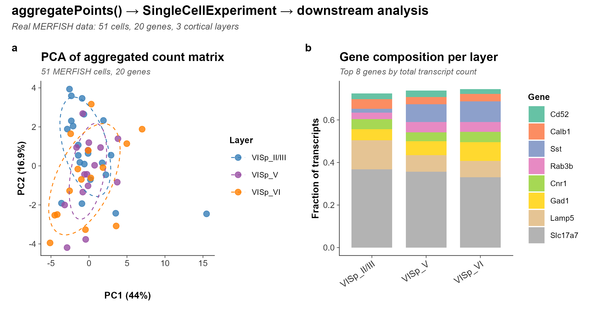

<div align="center">

# SpatialDataR

*Native R/Bioconductor Interface to the SpatialData Zarr Format for Spatial Omics*

[](https://github.com/CuiweiG/SpatialDataR/actions/workflows/R-CMD-check.yml)
[](https://opensource.org/licenses/Artistic-2.0)
[](https://bioconductor.org/)

</div>

---

## Why SpatialDataR?

SpatialData (Marconato et al. 2024, *Nat Methods*) established a
universal Zarr-based on-disk format for spatial omics, adopted by the
scverse ecosystem and supported by 10x Genomics Xenium, Vizgen MERFISH,
and NanoString CosMx platforms. However, R/Bioconductor users currently
require Python (via `reticulate`) to access these stores, creating
friction in analysis workflows that otherwise run entirely in R.

**SpatialDataR** provides a native R interface for reading, querying,
aggregating, transforming, and writing SpatialData-formatted Zarr
stores, exposing elements through Bioconductor-standard S4 classes:

- **Points and shapes**: `DataFrame` (CSV, Parquet, GeoParquet)
- **Images and labels**: lazy path references, loadable as in-memory
  arrays (`readZarrArray()`) or `DelayedArray` (`readZarrDelayed()`)
- **Tables**: AnnData-style obs/var, with optional `SpatialExperiment`
  coercion
- **Transforms**: OME-NGFF coordinate transforms (identity, scale,
  translation, affine, sequence) in 2D/3D

## Validation

All figures below use the **MERFISH mouse primary visual cortex (VISp)**
dataset (Moffitt et al. 2018, *Science*): **3,714,642 transcripts**,
**268 genes**, **160 cells**, **8 cortical layers**. Public domain
(CC0 1.0), reproducible via `inst/scripts/create_real_store.R`.

---

## 1. Native Zarr Store Reading

> `readSpatialData()` discovers all five element types and coordinate
> systems from a single function call. Points and shapes are eagerly
> loaded as `DataFrame`; images and labels remain as lazy path
> references until explicitly requested.

<div align="center">

</div>

> **Fig. 1.** 3,714,642 transcripts read from a SpatialData Zarr store
> via `readSpatialData()`, faceted by cortical layer. Laminar
> architecture is immediately visible: each layer occupies a distinct
> spatial region from pial surface (Layer I) to white matter.
> Scale bar: 500 um.

```r
library(SpatialDataR)
sd <- readSpatialData("merfish_visp.zarr")
sd
#> SpatialData object
#>   spatialPoints(1): transcripts [3714642 rows]
#>   shapes(1): cell_boundaries [160 rows]
#>   tables(1): table
#>   coordinate_systems: global
```

---

## 2. Bounding Box Spatial Query

> `bboxQuery()` subsets all spatial elements to a rectangular ROI,
> analogous to Python `spatialdata.bounding_box_query()`.

<div align="center">

</div>

> **Fig. 2.** (**a**) Transcript density map (3.7M molecules) with
> 400x400 um ROI (orange box). (**b**) Zoomed view of the queried
> region with cortical layer structure preserved at 5 um resolution.
> Scale bar: 100 um.

```r
sub <- bboxQuery(sd,
    xmin = 2000, xmax = 2400,
    ymin = 5200, ymax = 5600)
```

---

## 3. Region-Based Aggregation

> `aggregatePoints()` converts molecule coordinates into cell-by-gene
> count matrices, analogous to Python `spatialdata.aggregate()`.

<div align="center">

</div>

> **Fig. 3.** Cell x gene count matrix from **real MERFISH data**.
> Top 20 most variable genes (of 268), cells grouped by cortical layer,
> column-scaled expression. Transcripts assigned to cell centroids by
> nearest-neighbour matching.

```r
counts <- aggregatePoints(
    spatialPoints(sd)[["transcripts"]],
    shapes(sd)[["cell_boundaries"]],
    feature_col = "gene", region_col = "cell_id")
```

---

## 4. Coordinate Transform Composition

> `composeTransforms()` chains affine transforms;
> `invertTransform()` computes the inverse. Supports OME-NGFF
> identity, scale, translation, affine, and sequence types in 2D/3D.

<div align="center">

</div>

> **Fig. 4.** Eight real MERFISH cell coordinates transformed from
> pixel (blue x) to global (red dot) via composed scale + translate
> affine. Roundtrip error at machine precision (~10^-13).

```r
ct <- composeTransforms(
    CoordinateTransform("affine", affine = diag(c(0.5, 0.5, 1))),
    CoordinateTransform("affine",
        affine = matrix(c(1,0,500, 0,1,2000, 0,0,1), 3, byrow=TRUE)))
inv <- invertTransform(ct)
```

---

## 5. Read-Write Roundtrip

> `writeSpatialData()` produces SpatialData-formatted Zarr stores
> readable by Python `spatialdata`. `validateSpatialData()` verifies
> spec compliance (14/14 checks passed).

<div align="center">

</div>

> **Fig. 5.** Lossless roundtrip verification on 648,954 transcripts.
> (**a**) Per-gene transcript counts: original (blue) vs read-back
> (red) are identical across 3 orders of magnitude.
> (**b**) SpatialData spec compliance: 14/14 structural checks passed
> on the written `.zarr` store, including element directories,
> `.zattrs` metadata, and coordinate transforms.

```r
writeSpatialData(sub, "subset.zarr")
sd2 <- readSpatialData("subset.zarr")
validateSpatialData("subset.zarr")$valid  # TRUE
```

---

## 6. Downstream Bioconductor Integration

> `aggregatePoints()` output integrates directly with the Bioconductor
> single-cell ecosystem via `SingleCellExperiment`.

<div align="center">

</div>

> **Fig. 6.** Downstream analysis of **real MERFISH cells**.
> (**a**) PCA after log-normalization of the `aggregatePoints()` count
> matrix, coloured by cortical layer with 68% confidence ellipses.
> (**b**) Gene composition per layer (top 8 genes).

```r
counts <- aggregatePoints(pts, shapes,
    feature_col = "gene", region_col = "cell_id")
pca <- prcomp(log1p(as.matrix(counts[, -1])))
```

---

## Architecture

| Feature | Implementation |
|---|---|
| **Lazy loading** | Images/labels as path references; `readZarrDelayed()` for `DelayedArray` out-of-memory access |
| **Memory** | 3.7M-transcript object: 99 MB; image refs: <2 KB each |
| **Python interop** | `writeSpatialData()` produces Zarr v2 stores; `validateSpatialData()` checks 14 spec criteria |
| **Multimodal** | `readZarrArray()` loads images/masks; `cropImage()` extracts ROIs; all elements share coordinate systems |

---

## Additional Functions

| Function | Description |
|---|---|
| `validateSpatialData()` | Spec compliance checker |
| `combineSpatialData()` | Multi-sample merge |
| `filterSample()` | Extract single sample |
| `cropImage()` | Crop Zarr image by bounding box |
| `readZarrDelayed()` | Out-of-memory `DelayedArray` access |
| `assignToRegions()` | Nearest-neighbour point-to-region assignment |
| `elementSummary()` | Element overview table |
| `elementTransform()` | Extract transforms from metadata |
| `coordinateSystemElements()` | Map coordinate systems to elements |

---

## Installation

```r
if (!requireNamespace("remotes", quietly = TRUE))
    install.packages("remotes")
remotes::install_github("CuiweiG/SpatialDataR")

# Optional backends
BiocManager::install("Rarr")                 # Zarr arrays
install.packages("arrow")                    # Parquet
BiocManager::install("SpatialExperiment")    # Table coercion
```

## References

1. Marconato L et al. (2024). SpatialData: an open and universal data
   framework for spatial omics. *Nat Methods* 21:2196--2209.
   doi:[10.1038/s41592-024-02212-x](https://doi.org/10.1038/s41592-024-02212-x)

2. Moore J et al. (2023). OME-Zarr: a cloud-optimized bioimaging file
   format. *Histochem Cell Biol* 160:223--251.
   doi:[10.1007/s00418-023-02209-1](https://doi.org/10.1007/s00418-023-02209-1)

3. Righelli D et al. (2022). SpatialExperiment: infrastructure for
   spatially-resolved transcriptomics data in R. *Bioinformatics*
   38:3128--3131.
   doi:[10.1093/bioinformatics/btac299](https://doi.org/10.1093/bioinformatics/btac299)

4. Moses L & Pachter L (2023). Voyager: exploratory single-cell
   genomics data analysis with geospatial statistics. *Nat Methods*
   20:1431--1441.
   doi:[10.1038/s41592-023-01920-2](https://doi.org/10.1038/s41592-023-01920-2)

5. Parker TJ et al. (2023). MoleculeExperiment enables consistent
   infrastructure for molecule-resolved spatial omics. *Bioinformatics*
   39:btad550.
   doi:[10.1093/bioinformatics/btad550](https://doi.org/10.1093/bioinformatics/btad550)

6. Moffitt JR et al. (2018). Molecular, spatial, and functional
   single-cell profiling of the hypothalamic preoptic region. *Science*
   362:eaau5324.
   doi:[10.1126/science.aau5324](https://doi.org/10.1126/science.aau5324)
