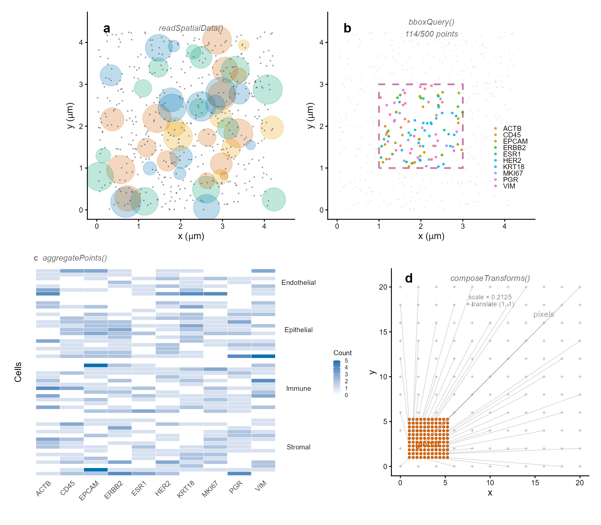

<div align="center">

# SpatialDataR

*Native R Infrastructure for Reading SpatialData Zarr Stores*

[](https://github.com/CuiweiG/SpatialDataR/actions/workflows/R-CMD-check.yml)
[](https://opensource.org/licenses/Artistic-2.0)
[](https://bioconductor.org/)

</div>

---

## The problem

[SpatialData](https://spatialdata.scverse.org/)
(Marconato et al. 2024 *Nat Methods*) defines a
universal Zarr-based format for spatial omics, building
on the OME-NGFF specification (Moore et al. 2023).
R/Bioconductor users currently need Python bridges
(reticulate) to access SpatialData stores — there is no
native R reader that understands the full SpatialData
data model (elements, coordinate systems, transforms,
spatial queries).

## What SpatialDataR provides

A complete R-native reimplementation of the core
SpatialData operations:

```r
library(SpatialDataR)

# Read a SpatialData Zarr store
sd <- readSpatialData("xenium_breast.zarr")
sd
#> SpatialData object
#>   path: /data/xenium_breast.zarr
#>   images(1): morphology
#>   spatialLabels(1): cell_labels
#>   spatialPoints(1): transcripts [500 rows]
#>   shapes(1): cell_boundaries [50 rows]
#>   tables(1): table
#>   coordinate_systems: global, pixels

# Validate spec compliance
validateSpatialData("xenium_breast.zarr")

# Spatial query (mirrors Python bounding_box_query)
sub <- bboxQuery(sd, xmin = 0, xmax = 100,
    ymin = 0, ymax = 100)

# Region aggregation (molecules -> cell-gene matrix)
counts <- aggregatePoints(
    spatialPoints(sd)[["transcripts"]],
    shapes(sd)[["cell_boundaries"]])

# Multi-sample analysis
combined <- combineSpatialData(sd1, sd2,
    sample_ids = c("tumor", "normal"))

# Transform composition + inversion
ct <- elementTransform(images(sd)[["morphology"]])
inv <- invertTransform(ct)
```

---

<div align="center">

</div>

> **Figure 1 | SpatialDataR core operations on a
> SpatialData Zarr store.** Simulated Xenium-like data
> (50 cells, 10 genes, 500 transcripts).
> (**a**) Multi-modal spatial map: transcripts (dots)
> overlaid on cell boundaries (colored circles) loaded
> via `readSpatialData()`.
> (**b**) Bounding box spatial query via `bboxQuery()`:
> 114/500 transcripts selected within the dashed region.
> (**c**) Cell × gene count matrix produced by
> `aggregatePoints()`, grouped by cell type.
> (**d**) Coordinate transform composition via
> `composeTransforms()`: pixel grid (gray +) mapped to
> global coordinates (orange) through scale + translate.

---

## Functions

### Store I/O

| Function | Description |
|----------|-------------|
| `readSpatialData()` | Read all elements from .zarr |
| `validateSpatialData()` | Spec compliance checker |
| `readZarrArray()` | Read Zarr array (Rarr/pizzarr) |
| `readParquetPoints()` | Read Parquet points (arrow) |
| `readCSVElement()` | Read CSV points/shapes |
| `readSpatialTable()` | AnnData table → SE |

### Accessors

| Function | Description |
|----------|-------------|
| `images()` / `spatialLabels()` | Raster refs |
| `spatialPoints()` / `shapes()` | Vector data |
| `tables()` | Annotation tables |
| `coordinateSystems()` | CS metadata |
| `elementSummary()` | Element overview |
| `names()` / `length()` / `[` | R idioms |

### Coordinate transforms (OME-NGFF)

| Function | Description |
|----------|-------------|
| `CoordinateTransform()` | 2D/3D affine |
| `transformCoords()` | DataFrame / matrix |
| `composeTransforms()` | Chain A → B → C |
| `invertTransform()` | Compute inverse |
| `elementTransform()` | Extract from metadata |

### Spatial operations

| Function | Description |
|----------|-------------|
| `bboxQuery()` | Bounding box subset |
| `aggregatePoints()` | Region aggregation |
| `combineSpatialData()` | Multi-sample merge |
| `filterSample()` | Extract one sample |

---

## Validation

The package ships with a structurally complete mini
Zarr store (`xenium_mini.zarr`) and validation scripts:

```r
# Quick validation
result <- validateSpatialData(
    system.file("extdata", "xenium_mini.zarr",
        package = "SpatialDataR"))
result$valid
#> [1] TRUE
```

For validation against real public datasets (MERFISH,
Xenium, Visium HD), see
`inst/scripts/validate_real_data.R`. Datasets are
downloaded from the official
[scverse SpatialData repository](https://spatialdata.scverse.org/en/stable/tutorials/notebooks/datasets/README.html)
(CC BY 4.0 / CC0 1.0).

---

## Installation

```r
if (!requireNamespace("remotes", quietly = TRUE))
    install.packages("remotes")
remotes::install_github("CuiweiG/SpatialDataR")
```

## References

- Marconato L et al. (2024). SpatialData: an open and
  universal data framework for spatial omics.
  *Nat Methods* 21:2196.
  doi:10.1038/s41592-024-02212-x
- Moore J et al. (2023). OME-Zarr: a cloud-optimized
  bioimaging file format. *Histochem Cell Biol* 160:223.
  doi:10.1007/s00418-023-02209-1
- Righelli D et al. (2022). SpatialExperiment:
  infrastructure for spatially-resolved transcriptomics.
  *Bioinformatics* 38:3128.
  doi:10.1093/bioinformatics/btac299
- Moses L & Bhatt P (2023). Voyager: exploratory
  single-cell genomics data analysis with geospatial
  statistics. *Nat Methods* 20:1431.
  doi:10.1038/s41592-023-01920-2
